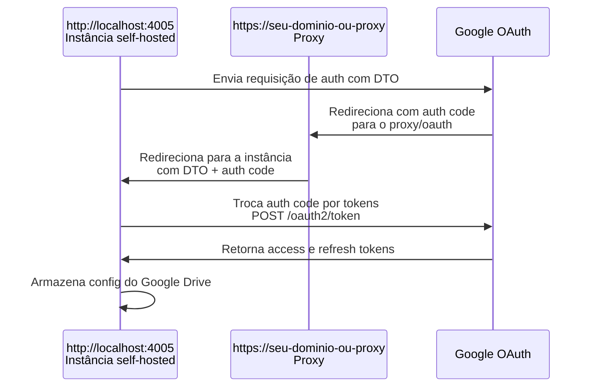

# OAuth para storages em nuvem

Storages em nuvem em geral exigem OAuth (Google Drive, Dropbox, OneDrive).

Serviços OAuth costumam exigir um domínio HTTPS para autorização. Uma instância self-hosted pode estar em HTTP ou sem IP estático, o que impede o fluxo direto. Para que o OAuth funcione mesmo em localhost, é possível usar um proxy em um domínio HTTPS (por exemplo o domínio do projeto original ou um domínio próprio).

Como URL permanente de autorização pode ser usado o domínio principal do proxy. Ele encaminha as respostas para a instância self-hosted para que ela obtenha acesso à nuvem.

Exemplo de sequência (Google Drive):

